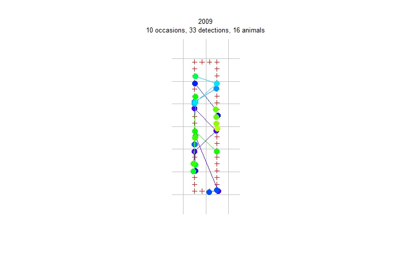
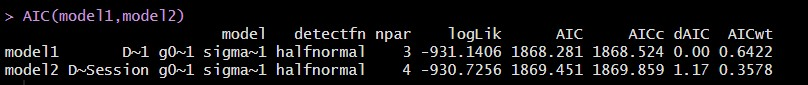
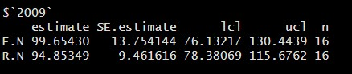

1. Install and load packages → library("secr")

2. List all available datasets in the secr package → data(package = "secr")

3. Load ovenbird data → data(ovenbird)

4. Inspect and plot capthist locations → summary(ovenbird) 
                                       → plot(ovenCH, tracks = TRUE)

5. View detectors → traps(ovenCH) 
                  → plot(traps(ovenCH))

6. Fit mask model → make.mask(traps(ovenCH)[["2005"]],type = "trapbuffer", buffer = 400, spacing = 15)

7. Fit multiple models 

8. AIC selection of models

9. View density results 

Below are the final plots and metrics that should be produced:

 
