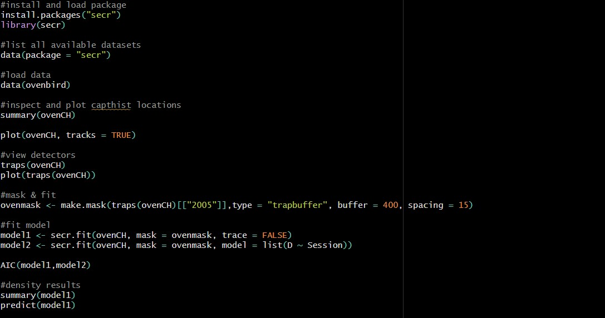

1. install and load packages → library("secr")

2. list all available datasets in the secr package → data(package = "secr")

3. load ovenbird data → data(ovenbird)

4. inspect and plot capthist locations → summary(ovenbird) 
                                       → plot(ovenCH, tracks = TRUE)

5. view detectors → traps(ovenCH) 
                  → plot(traps(ovenCH))

6. fit mask model → make.mask(traps(ovenCH)[["2005"]],type = "trapbuffer", buffer = 400, spacing = 15)

7. fit multiple models 

8. AIC selection of models

9. view density results 

