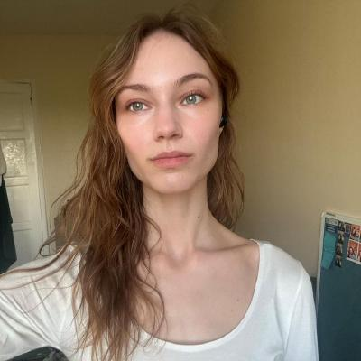

## Myself 

:::: {layout-ncol=2}

::: {}
Hello, I am Sara Lois Thomas.

I am an MSc Statistical Ecology student at the University of St Andrews currently working on machine 
learning and transfer Learning for classification in acoustic spectograms.
:::

::: {}

:::

::::

## Academic Focus

SECR is the final stage of a project I am helping with from collected Gibbon spectograms, occurring after data processing, machine learning with Convolutional Neural Networks (CNNs) and a Shiny app. 

This website will help you with the R package, SECR (spatially explicit capture-recapture), used in estimating animal abundances.

---
## Contact

Email: slt7@st-andrews.ac.uk

GitHub: slt77