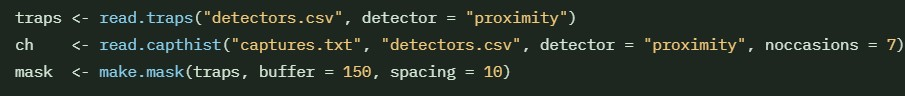
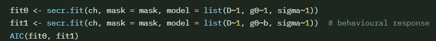

**AIM: To improve model validation, data processing, data visualisation with the SECR package**

## SECR Package
Spatially Explicit Capture Recapture

Estimate the density and size of spatially distributed animal populations from detector arrays via passive acoustic monitors (PAMs), using the maximum-likelihood.

SECR models the detection locations and the histories of marked animals, allowing you to estimate population density and to fit a model to show how probability declines with distance from each detector, including spatial/temporal trends (Efford and Fewster, 2012).

Detection functions describe the probability of detection as a given detector declines with distance (non-euclidean) from animals activity centre, the most commonly used is Half-Normal (HN) (Efford and Schofield, 2022).

- Traps = detector coordinates & type
- capthist = detection histories per individual
- mask = habitat grid for the likelihood

::: {.callout-note}
The **secr** R package assumes the population is *closed* during the sampling period so there is no movement out of the area - no births, deaths, immigration or emigration occurs (Efford and Schofield, 2022). 
:::

1. First install the package from CRAN
2. Load the secr package
3. List all available detection functions with ?detectfn

---

## Detectors & Data

SECR needs a traps object (detector locations) and a capthist object (detection histories). This can be done with a csv file, or from acoustic detectors, only the detector type needs to be changed from proximity to signal.

traps <- read.traps.("detector.csv", detector = "proximity")

The capture history data needs to have the columns: session, animal ID, occasion and detector ID.

::: {.callout-note}
Animal IDs must be **unique** within a session. Otherwise use multi-season capthist objects.
:::

---

## Fitting the Model
The fitted secr model:
fit0 <- secr.fit(ch,mask = mask, 
                 model = list(D~1, g0~1, sigma~1), detectfn = "HN")

Now add covariates to the fitted model:
fitB <- secr.fit(ch, model=list(D~1, g0~b, sigma~1)) 

---

## Model Validation & Selection

- Inspect parameter estimates → predict(fit0) w// 95% CIs
- Model Comparison → AIC(fit0, fitB)
- Density estimates → region.N(fit0)

---

## Microphone Arrays & Signal Strength

---

## Example and ACRE Package

::: {.grid}

::: {.g-col-6}
### Example with "secr" package
Live Demo with the Ovenbird dataset.

[View more →](#)
:::

::: {.g-col-6}
### Overview of "acre"
Important notes on using this package for acoustics.

[View more →](#)
:::

:::

---
## Further Reading

Visit the GitHub page of the creator, [Murray Efford →](https://github.com/MurrayEfford/secr/)

## References

Clink, D.J., Zafar, M., Ahmad, A.H. and Lau, A.R. (2021). Limited Evidence for Individual Signatures or Site-Level Patterns pf Variation in Male Northern Gray Gibbon (Hylobates funereus) Duet Codas. International Journal of Primatology, 42(12), pp:1-19. DOI: 10.1007/s10764-021-00250-2. 

Efford, M.G. and Fewster, R.M. (2012). Estimating population size by spatially explicit capture-recapture. Oikos, 122(6), pp. 918-928. DOI: 10.1111/j.1600-0706.2012.20440.x.

Efford, M.G. and Schofield, M.R. (2022). A review of movement models in open population capture-recapture. Methods in Ecology and Evolution, 13(10), pp. 2106-2118. DOI: 10.1111/2041-210X.13947.
