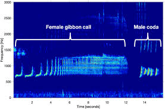

This is my Quarto website.

**AIM: To improve model validation, data processing, data visualisation with the SECR package**

## Data
First section
This includes data processed from spectograms, collected in Laos from Gibbon calls, specifically northern-white cheeked gibbons. 

## Data Processing
Second section

- 1
- 2
- 3

---

## SECR Package
Spatially Explicit Capture Recapture

Estimate the density and size of spatially distributed animal populations from detector arrays via passive acoustic monitors (PAMs), using maximum-likelihood SECR models.
SECR models the detection locations and the histories of marked animals, allowing you to estimate population density and to fit a model to show how probability declines with distance from each detector, including spatial/temporal trends (Efford and Fewster, 2012).

Detection functions describe the probability of detection as a given detector declines with distance (non-euclidean) from animals activity centre, the most commonly used is Half-Normal (HN) (Efford and Schofield, 2022).

::: {.callout-note}
The **secr** R package assumes the population is *closed* during the sampling period so there is no movement out of the area - no births, deaths, immigration or emigration occurs (Efford and Schofield, 2022). 
:::

- 1. First install from CRAN: install.packages("secr")
- 2. Load package: library(secr)
- 3. List all available detection functions: ?detectfn

## Model Validation
::: {.callout-note}
A structured academic investigation into [topic].
:::

---

## Data Visualisation

::: {.grid}

::: {.g-col-6}
### Project 1
Short description of what you did.

[View more →](#)
:::

::: {.g-col-6}
### Project 2
Short description of another project.

[View more →](#)
:::

:::

---
## Further Reading

If you want extra reading/clarification for this package then see the GitHub page of the creator, Murray Efford. 

[Murray Efford →](https://github.com/MurrayEfford/secr/)

## References

Clink, D.J., Zafar, M., Ahmad, A.H. and Lau, A.R. (2021). Limited Evidence for Individual Signatures or Site-Level Patterns pf Variation in Male Northern Gray Gibbon (Hylobates funereus) Duet Codas. International Journal of Primatology, 42(12), pp:1-19. DOI: 10.1007/s10764-021-00250-2. 

Efford, M.G. and Fewster, R.M. (2012). Estimating population size by spatially explicit capture-recapture. Oikos, 122(6), pp. 918-928. DOI: 10.1111/j.1600-0706.2012.20440.x.

Efford, M.G. and Schofield, M.R. (2022). A review of movement models in open population capture-recapture. Methods in Ecology and Evolution, 13(10), pp. 2106-2118. DOI: 10.1111/2041-210X.13947.
